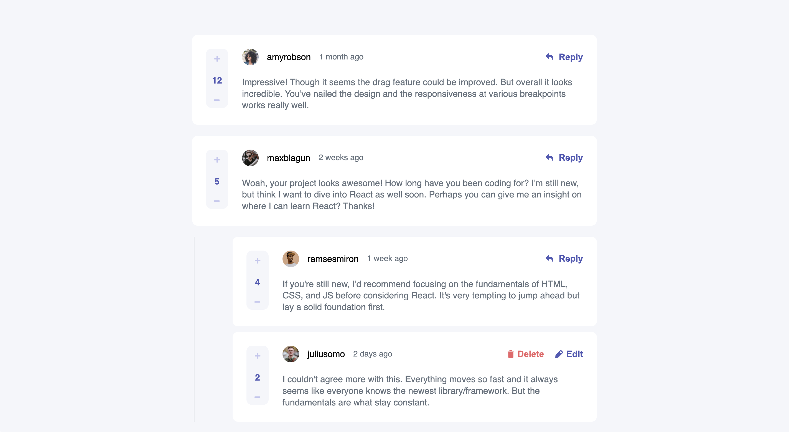

# Frontend Mentor - Interactive comments section solution

This is a solution to the [Interactive comments section challenge on Frontend Mentor](https://www.frontendmentor.io/challenges/interactive-comments-section-iG1RugEG9). Frontend Mentor challenges help you improve your coding skills by building realistic projects.

## Table of contents

- [Overview](#overview)
    - [The challenge](#the-challenge)
    - [Screenshot](#screenshot)
    - [Links](#links)
- [My process](#my-process)
    - [Built with](#built-with)
    - [What I learned](#what-i-learned)
    - [Continued development](#continued-development)
    - [Useful resources](#useful-resources)
- [Author](#author)

## Overview

### The challenge

Users should be able to:

- View the optimal layout for the app depending on their device's screen size
- See hover states for all interactive elements on the page
- Create, Read, Update, and Delete comments and replies
- Upvote and downvote comments
- **Bonus**: If you're building a purely front-end project, use `localStorage` to save the current state in the browser that persists when the browser is refreshed.
- **Bonus**: Instead of using the `createdAt` strings from the `data.json` file, try using timestamps and dynamically track the time since the comment or reply was posted.


### Screenshot



### Links

- Solution URL: [Solution URL](https://github.com/amjadsh97/interactive-comments)
- Live Site URL: [Live site](https://interactive-comments-tan.vercel.app/)

## My process

### Built with

- Semantic HTML5 markup
- CSS custom properties
- Flexbox, Grid layout
- [React](https://reactjs.org/) - JS library

### What I learned

* Adding Comments:
 I learned how to implement a feature that allows users to add comments to the platform.
 This involved creating a user-friendly interface for composing and submitting comments.
 I also considered factors like validation and error handling to ensure a smooth user experience.


* Adding Replies:
 Building on the comment functionality, I extended the system to support replies to existing comments.
 This required additional UI elements and logic to distinguish between primary comments and replies.
 I ensured that replies were visually distinct from comments while maintaining a cohesive user interface.
 

* Upvoting:
 To enhance engagement and community interaction, I integrated upvoting functionality.
 Users can now express appreciation for comments or replies by upvoting them.
 Implementing upvoting involved backend integration and frontend design considerations to reflect user interactions accurately.
 
#### Javascript code
```js
	const handleAddReply = (id, newReplyContent) => {
	const updatedComments = comments.map(c => {
		if (c.id === id) {
			return {
				...c,
				replies: [
					...c.replies,
					{
						id: Math.floor(Math.random() * 1000), // Increase the range for unique IDs
						content: newReplyContent,
						createdAt: new Date().toLocaleString(),
						score: 0,
						replyingTo: currentUser.username,
						user: currentUser
					}
				]
			};
		}
		return c;
	});

	setComments(updatedComments);
	setNewReply("");
	setShowReply(false); // Close the reply form after adding a new reply
};
```


### Continued development

In the future, I will prioritize further developing my skills in make authentication system and integrate the app with backend.


### Useful resources

- [React Docs](https://react.dev/) - This helped me for building react components. I really liked using this docs.

## Author

- Website - [Amjad Shadid](https://amjadshadid.vercel.app/)
- Frontend Mentor - [@amjadsh97](https://www.frontendmentor.io/profile/amjadsh97)
- Twitter - [@Amjadshadid](https://twitter.com/Amjadshadid)
- Linkedin - [@Amjad Shadid](https://www.linkedin.com/in/amjad-shadid-134355134/)